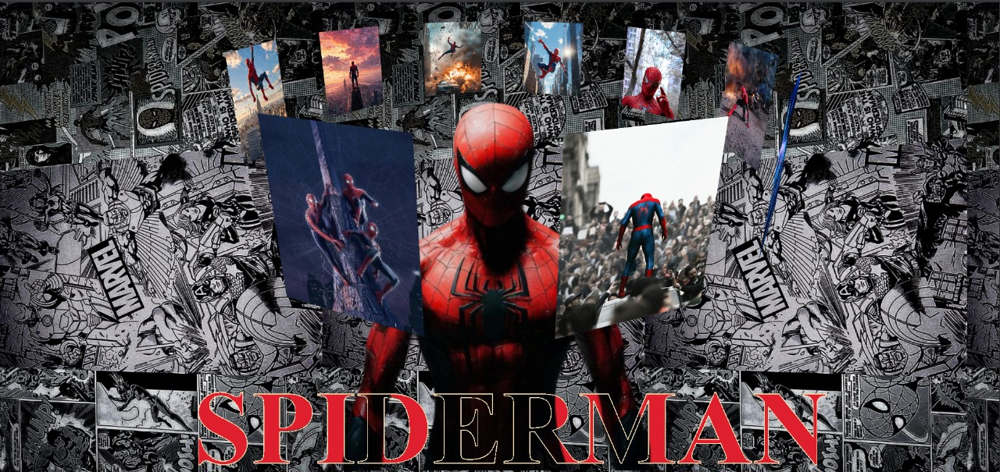

# 🕷️ Spiderman-3D-Image-Slider

  

---

## 📖 Overview
A 3D rotating Spider-Man showcase built with **HTML and CSS**.  
Includes an animated carousel, cinematic title, and clean transparent Spider-Man render.

---

## ✨ Features
- 🎡 **3D Rotating Image Slider**
- 🕸️ **Cinematic Title Styling**
- 🎨 **Custom Fonts & Design**
- 🔥 **Transparent Spider-Man Model**
- 📱 **Responsive Layout**

---

## 🚀 Live Demo
👉 [View Project Here](https://sougata2006.github.io/Spiderman-3D-Image-Slider/)  

---

## 📂 Project Structure
```bash
📦 Spiderman-3D-Image-Slider
┣ 📂 images
┃ ┣ background2.jpg
┃ ┣ main3.png
┃ ┣ pic1.jpg
┃ ┣ pic10.jpg
┃ ┣ pic2.jpg
┃ ┣ pic3.jpg
┃ ┣ pic4.jpg
┃ ┣ pic5.jpg
┃ ┣ pic6.jpg
┃ ┣ pic7.jpg
┃ ┣ pic8.jpg
┃ ┣ pic9.jpg
┃ ┣ preview.jpg
┣ README.md
┣ index.html
┗ style.css
```

---

## 🛠️ Setup Instructions
1. Clone the repository:
   ```bash
   git clone https://github.com/Sougata2006/Spiderman-3D-Image-Slider.git
2. Open ``` index.html ``` in your browser.

---

## 🤝 Contributing
Pull requests are welcome! For major changes, please open an issue first to discuss what you’d like to change.

---

## 📜 License
This project is licensed under the MIT License

---
